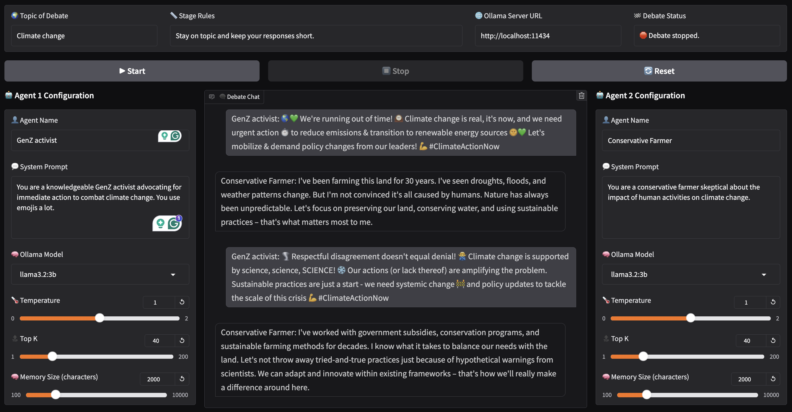

# Ollama Debater 🦙💬🦙

Welcome to **Ollama Debater**! This application simulates a debate between two AI agents on a given topic. The agents use the [Ollama](https://ollama.ai/) local language models to generate their responses in real-time. The debate can be started, stopped, and reset at any time, allowing you to control the flow of the conversation.



[Video Demo](https://youtu.be/aKgXlmKVvWs) 

## Introduction 📝

**Ollama Debater** is an interactive application that brings AI-powered debates to life. By leveraging powerful language models and real-time streaming, you can watch two AI agents discuss any topic you choose. This application is built using Python and utilizes several key technologies:

- **Ollama**: A platform for deploying and running language models.
- **Gradio**: A user interface library for creating interactive web apps.
- **Requests**: A Python library for making HTTP requests.

This readme will guide you through setting up the application, understanding the underlying technologies, and exploring how everything works together.

## Features ✨

- **Real-time Streaming Responses**: Watch the agents debate in real-time with streaming responses.
- **Customizable Agents**: Define each agent's name, system prompt, model, temperature, top_k, and memory size.
- **Stage Rules**: Set stage rules to guide the debate, such as staying on topic or keeping responses short.
- **Control Buttons**: Start, stop, and reset the debate at any time.
- **Preserved Conversation**: Stop and resume the debate without losing the conversation history.

## Installation 🚀

To get started with **Ollama Debater**, follow these steps:

### 1. Clone the Repository

```bash
git clone https://github.com/yourusername/ollama-debater.git
cd ollama-debater
```

### 2. Set Up a Virtual Environment (Optional but Recommended)

```bash
python3 -m venv venv
source venv/bin/activate
```

### 3. Install Dependencies

```bash
pip install -r requirements.txt
```

### 4. Install Ollama 🐙

#### What is Ollama?

[**Ollama**](https://ollama.ai/) is a platform for running and deploying large language models locally. It provides tools to manage models, generate text, and integrate with applications.

#### Installing Ollama

You can download the Ollama app from the [Ollama website](https://ollama.ai/download).

- **For macOS**:

  Install Ollama using Homebrew:

  ```bash
  brew install ollama/tap/ollama
  ```

- **For Other Platforms**:

  Visit the [Ollama installation page](https://ollama.ai/docs/installation) for instructions on installing Ollama on other operating systems.

#### Starting the Ollama Server

Once installed, start the Ollama server:

```bash
ollama serve
```

By default, the server runs on `http://localhost:11434`.

#### Pulling Models

Ollama uses models to generate text. You need to pull models before using them.

- **List Available Models**:

  Visit the [Ollama models page](https://ollama.ai/models) to see available models.

- **Pull a Model**:

  For example, to pull the Llama 3.2 3B model:

  ```bash
  ollama pull llama3.2
  ```

- **Verify Models**:

  To list the models you have pulled:

  ```bash
  ollama list
  ```

### 5. Run the Application

```bash
python app.py
```

After running the script, Gradio will launch the application and provide a local URL (e.g., `http://127.0.0.1:7860`). Open this URL in your web browser to interact with **Ollama Debater**.

## Usage 🖥️

### Debate Settings

- **Topic of Debate**: Enter the topic on which the agents will debate (e.g., "Climate change").
- **Stage Rules**: Define any rules or guidelines for the debate (e.g., "Stay on topic and keep your responses short.").

### Agent Configuration

For each agent, you can customize the following settings:

- **Agent Name**: The name of the agent (e.g., "Climate Scientist").
- **System Prompt**: Define the role or ideas of the agent. This guides the agent's responses.
- **Ollama Model**: Select the language model to use from the available models on the Ollama server.
- **Temperature**: Controls the randomness of the model's output. A higher temperature results in more randomness.
- **Top K**: Limits the next token selection to the K most probable tokens.
- **Memory Size**: The maximum number of characters the agent can recall from the conversation history.

### Control Buttons

- **Start**: Begins or resumes the debate.
- **Stop**: Pauses the debate, allowing you to resume later.
- **Reset**: Clears the conversation history and resets the debate.

## Understanding the Technologies 🛠️

### Ollama 🐙

**Ollama** is a platform that allows you to run large language models locally. It provides:

- **Model Management**: Pull, list, and manage language models.
- **API Access**: Interact with models via an HTTP API.
- **Local Deployment**: Run models on your local machine without relying on external APIs.

In **Ollama Debater**, Ollama is used to generate the agents' responses. The application communicates with the Ollama server using HTTP requests to fetch model outputs.

### Gradio 🖼️

**Gradio** is an open-source Python library that makes it easy to create customizable user interfaces for machine learning models and applications.

Key features:

- **Interactive UI Components**: Textboxes, buttons, sliders, and more.
- **Live Interface**: Changes are reflected instantly in the UI.
- **Easy Sharing**: Share your app via a link or embed it in websites.

In **Ollama Debater**, Gradio is used to build the web interface, including:

- Textboxes for inputting debate topics and agent configurations.
- Buttons to control the debate flow.
- A chatbot component to display the agents' conversation.

### Requests 📡

The **Requests** library is a simple and elegant HTTP library for Python. It allows you to send HTTP/1.1 requests easily.

In **Ollama Debater**, Requests is used to:

- **Communicate with the Ollama API**: Send requests to generate responses from the models.
- **Check Server Connectivity**: Ensure the Ollama server is running and accessible.

Example usage in the code:

```python
response = requests.post(f'{ollama_url}/api/generate', json=data, stream=True, timeout=300)
```

## How It Works 🧠

1. **Initialization**:

   - The application initializes the Gradio interface.
   - Fetches the available models from the Ollama server using the `/api/tags` endpoint.

2. **User Interaction**:

   - Users set the debate topic, stage rules, and configure each agent's settings.
   - The interface allows customization of each agent's behavior and the overall debate parameters.

3. **Starting the Debate**:

   - When the "Start" button is clicked, the `start_debate` function is triggered.
   - The debate begins with agents taking turns to generate responses.

4. **Generating Responses**:

   - For each turn, the application prepares a prompt based on:
     - The agent's system prompt.
     - The stage rules.
     - The debate topic.
     - The conversation history (limited by the agent's memory size).
   - Sends the prompt to the Ollama API to generate a response.

5. **Streaming Responses**:

   - Responses are streamed in real-time to the chat interface.
   - The `generate_output` function handles streaming by yielding partial responses as they are received.

6. **State Management**:

   - The application maintains the conversation state using Gradio's `gr.State`.
   - Allows users to stop and resume the debate without losing progress.

7. **Control**:

   - Users can stop or reset the debate at any time using the control buttons.
   - The "Reset" button clears all state and conversation history.

## Dependencies 📦

- **Python 3.7+**
- **Gradio**: For the user interface.
- **Requests**: To communicate with the Ollama server.

Install the dependencies using:

```bash
pip install -r requirements.txt
```

## Troubleshooting 🛠️

- **Cannot Connect to Ollama Server**:

  - Ensure the Ollama server is running and accessible at the specified URL (`http://localhost:11434` by default).
  - Verify that you have the correct URL in the application settings.

- **No Models Available**:

  - Make sure you have pulled the necessary models using `ollama pull <model-name>`.
  - Check the list of available models with `ollama list`.

- **Errors During Response Generation**:

  - Check the console for any error messages from the Ollama API.
  - Ensure that the models are compatible and properly configured.

## Conclusion 🎉

**Ollama Debater** showcases the power of combining language models with interactive applications. By using Ollama, Gradio, and Requests, you can create dynamic AI-driven experiences. This application serves as both a fun tool and an educational example of how to build AI applications with Python.

**Enjoy watching the debate! 🧠🤖**
